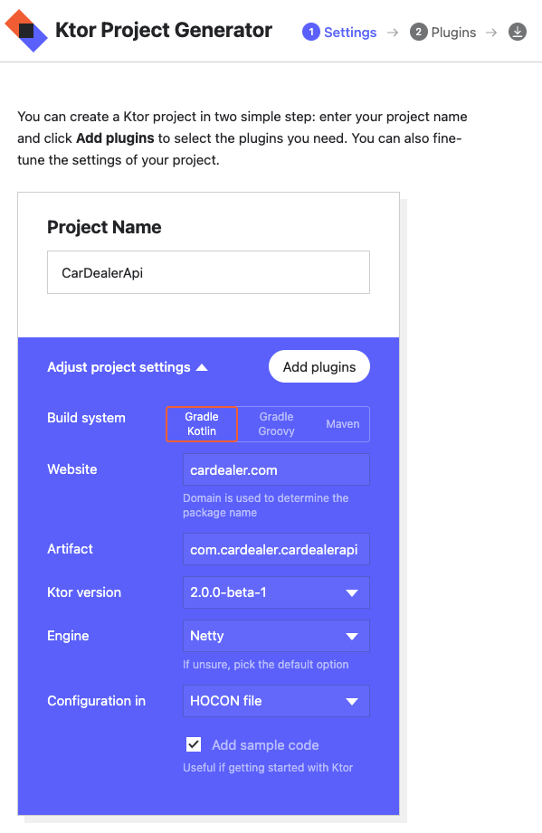
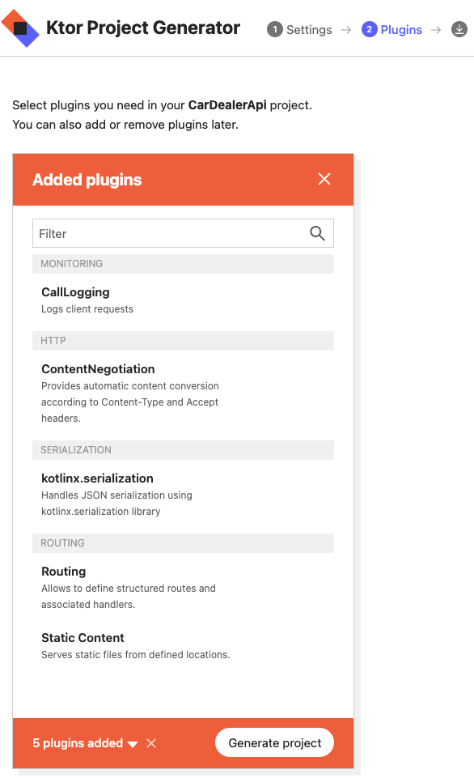

# Web Service with Ktor

This simple application is a demonstration of writing web service using Ktor.

## Initial

You can use the link below to simply create an application from scratch with 
dependencies and plugins included

[Start Ktor](https://start.ktor.io/)

## Start Ktor Steps

After setting your properties (example image below), just click ```Add plugins``` 
button to choose plugins for your project needs



This project uses
- CallLogging
- ContentNegotiation
- kotlinx.serialization
- Routing
- Static Content



After selecting plugins just hit ```Generate project``` button, and you are good to go. 
Now, you can open your zipped project and open it with [IntelliJ IDEA](https://www.jetbrains.com/idea/download/) 
<-- which you can download from here

## Run Project

When you run application and encounter with port problem, like port 8080 is unavailable,
just navigate to ``application.conf`` file and update port.

Type ```http://localhost:8080/``` to your browser and this is it.

| Route                              | Explanation                                                                  |
|------------------------------------|------------------------------------------------------------------------------|
| http://localhost:8080/             | index.html                                                                   |
| http://localhost:8080/cars         | Returns list of cars                                                         |
| http://localhost:8080/{brand_name} | Takes brand_name as parameter and returns a car if exists in the static list |